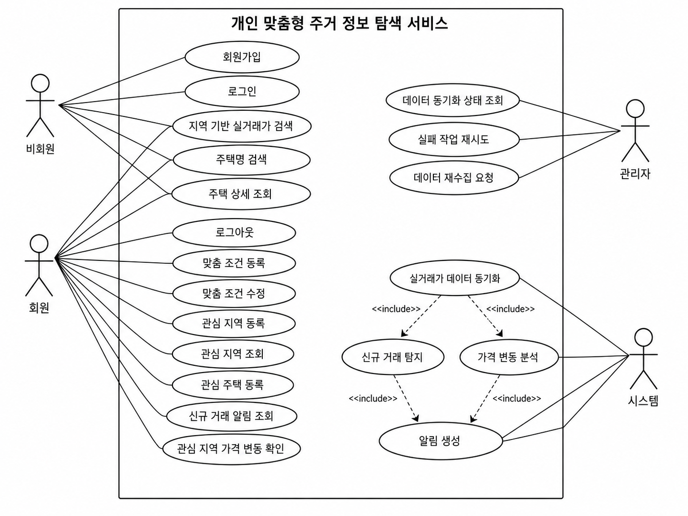
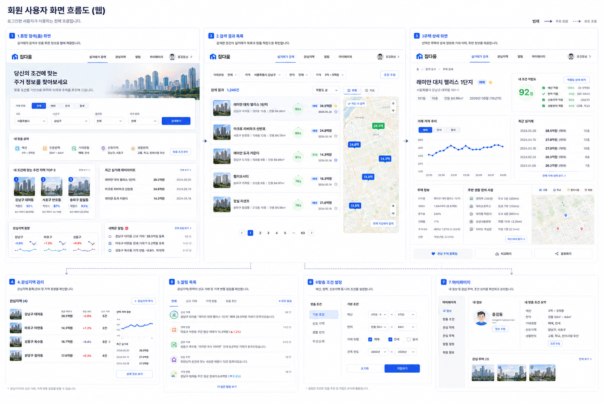
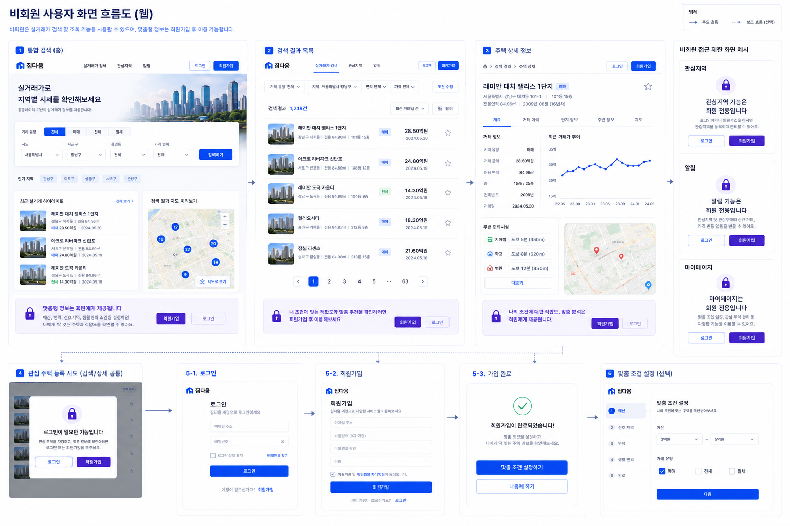
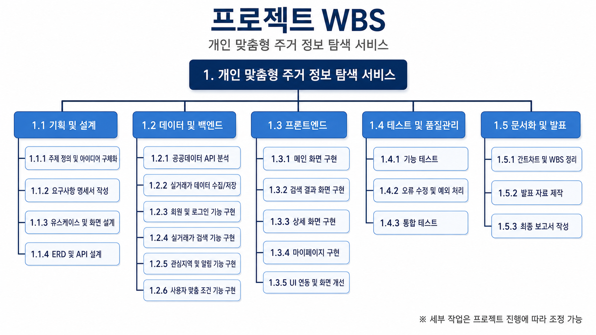

# 프로젝트 기획서

# 1. 주제 및 아이디어 선정

## 1.1 프로젝트명

개인 맞춤형 주거 정보 탐색 서비스

---

## 1.2 프로젝트 개요

공공데이터 기반 실거래가 정보를 활용하여 사용자의 예산, 선호 지역, 거래 유형, 생활 우선순위에 맞는 주거 정보를 탐색하고 비교할 수 있는 서비스이다.

단순 실거래가 조회 기능을 넘어, 사용자의 조건에 적합한 지역과 주택을 우선적으로 제공하고 관심 지역의 거래 변화를 지속적으로 확인할 수 있도록 구성한다.

---

## 1.3 프로젝트 배경

기존 부동산 서비스는 정보량은 많지만 사용자가 직접 원하는 조건을 조합해서 찾아야 하는 불편함이 존재한다.

특히 처음 주거지를 탐색하는 사용자 입장에서는 지역별 가격 수준, 거래 유형 차이, 생활 인프라 등을 비교하기 어렵다.

본 프로젝트는 사용자가 중요하게 생각하는 조건을 기반으로 필요한 정보만 우선적으로 제공하여 보다 효율적으로 주거 정보를 탐색할 수 있도록 하는 것을 목표로 한다.

---

## 1.4 타겟 사용자

### 1인 가구 및 사회초년생

- 예산 범위 내 주거지를 찾고 싶은 사용자
- 월세, 전세, 매매 비용을 비교하고 싶은 사용자

### 이사 예정 사용자

- 특정 지역의 실거래 흐름을 확인하고 싶은 사용자

### 생활 인프라를 중요하게 생각하는 사용자

- 병원, 편의점, 교통, 학군 등 주변 환경을 함께 확인하고 싶은 사용자

---

## 1.5 프로젝트 핵심 기능

### 공공데이터 기반 실거래가 수집

국토교통부 실거래가 API를 활용하여 지역별 실거래가 데이터를 수집하고 DB에 저장한다.

### 사용자 맞춤 조건 기반 검색

사용자가 등록한 예산, 거래 유형, 선호 지역 등을 기반으로 검색 결과를 개인화한다.

### 관심 지역 중심 데이터 관리

사용자가 관심 있는 지역을 등록하고 관리할 수 있도록 한다.

### 주변 생활 정보 제공

지도 API와 공공데이터를 활용하여 주변 편의시설 정보를 함께 제공한다.

---

# 2. 기능 목록

## 2.1 회원 기능

- 회원가입
- 로그인 / 로그아웃
- 회원 정보 조회
- 회원 정보 수정
- 회원 탈퇴

---

## 2.2 실거래가 기능

- 지역 기반 실거래가 검색
- 주택명 기반 검색
- 거래 유형 필터링
- 주택 상세 조회
- 거래 이력 조회

---

## 2.3 사용자 맞춤 기능

- 사용자 맞춤 조건 등록
- 예산 기반 필터링
- 선호 지역 기반 결과 제공
- 조건 적합 여부 표시
- 관심 지역 관리
- 관심 주택 관리

---

## 2.4 생활 정보 기능

- 주변 편의시설 조회
- 시설 유형별 필터링
- 지도 기반 위치 표시

---

# 3. 요구사항 명세서

## 3.1 기능적 요구사항

| ID | 요구사항명 | 상세 내용 |
| --- | --- | --- |
| F-001 | 회원가입 | 사용자는 회원가입을 할 수 있다. |
| F-002 | 로그인 | 사용자는 로그인 및 로그아웃을 할 수 있다. |
| F-003 | 실거래가 검색 | 사용자는 지역 또는 주택명 기준으로 실거래가를 검색할 수 있다. |
| F-004 | 거래 유형 필터 | 사용자는 매매, 전세, 월세 기준으로 데이터를 필터링할 수 있다. |
| F-005 | 주택 상세 조회 | 사용자는 특정 주택의 상세 정보와 거래 이력을 확인할 수 있다. |
| F-006 | 맞춤 조건 등록 | 사용자는 예산, 선호 지역, 거래 유형 등을 등록할 수 있다. |
| F-007 | 맞춤 결과 제공 | 시스템은 사용자 조건에 적합한 결과를 우선적으로 제공한다. |
| F-008 | 관심 지역 등록 | 사용자는 관심 지역을 등록할 수 있다. |
| F-009 | 관심 주택 등록 | 사용자는 관심 주택을 등록할 수 있다. |
| F-010 | 주변 시설 조회 | 사용자는 특정 지역 주변의 편의시설 정보를 확인할 수 있다. |

---

## 3.2 비기능적 요구사항

| ID | 요구사항명 | 상세 내용 |
| --- | --- | --- |
| NF-001 | 응답 속도 | 검색 결과는 빠르게 제공되어야 한다. |
| NF-002 | 데이터 정확성 | 공공데이터 기반 실거래가 데이터를 정확하게 저장해야 한다. |
| NF-003 | 데이터 중복 방지 | 동일 거래 데이터가 중복 저장되지 않아야 한다. |
| NF-004 | 사용자 편의성 | 복잡하지 않은 검색 흐름을 제공해야 한다. |
| NF-005 | 보안 | 비밀번호는 암호화하여 저장해야 한다. |
| NF-006 | 안정성 | 외부 API 오류 발생 시 예외 처리를 수행해야 한다. |

---

# 4. REST API 명세서

### 4.1 회원 (Auth & User)

| 기능 | Method | URL | 비고 |
| --- | --- | --- | --- |
| 로그인 | `POST` | `/auth/login` | |
| 로그아웃 | `POST` | `/auth/logout` | |
| 회원가입 | `POST` | `/users` | |
| 회원 정보 조회 | `GET` | `/users/info` | |
| 회원 정보 수정 | `PATCH` | `/users/info` | |
| 회원 탈퇴 | `PATCH` | `/users/info` | |

### 4.2 실거래가 (House Transactions)

| 기능 | Method | URL | 비고 |
| --- | --- | --- | --- |
| 주택 실거래가 검색 | `GET` | `/houses` | |
| 주택 상세 조회 | `GET` | `/houses/{houseId}` | |
| 거래 이력 조회 | `GET` | `/houses/{houseId}/histories` | |

### 4.3 사용자 맞춤 (Personalization)

| 기능 | Method | URL | 비고 |
| --- | --- | --- | --- |
| 사용자 맞춤 조건 전체 저장 | `PUT` | `/users/info/preferences` | 조건 조합 |
| 사용자 맞춤 조건 해제 | `DELETE` | `/users/info/preferences` | 조건 조합 |
| 조건 적합 여부 표시 | `GET` | `/users/info/preferences` | 선호 지역, 예산, 면적, 생활 시설 등 |
| 관심 지역 조회 | `GET` | `/users/info/regions` | |
| 관심 지역 등록 | `POST` | `/users/info/regions` | |
| 관심 지역 해제 | `DELETE` | `/users/info/regions` | |
| 관심 주택 조회 | `GET` | `/users/info/houses` | |
| 관심 주택 등록 | `POST` | `/users/info/houses` | |
| 관심 주택 해제 | `DELETE` | `/users/info/houses` | |

### 4.4 생활 정보 (Surroundings)

| 기능 | Method | URL | 비고 |
| --- | --- | --- | --- |
| 주택 주변 편의시설 조회 | `GET` | `/properties/{propertyId}/surroundings` | 주택 상세 화면에서 사용 |

---

# 5. 유스케이스

## 5.1 사용자 유스케이스

### 비회원

- 회원가입
- 로그인
- 지역 기반 실거래가 검색
- 주택명 검색
- 주택 상세 조회

### 회원

- 맞춤 조건 등록
- 관심 지역 등록
- 관심 주택 등록
- 맞춤 검색 결과 조회

### 관리자

- 데이터 동기화 상태 확인
- 데이터 재수집 요청
- 실패 작업 재시도

---

## 5.2 유스케이스 흐름

---

# 6. 화면 설계

## 6.1 회원 화면 흐름도

---

## 6.2 비회원 화면 흐름도

---

# 7. WBS

---
